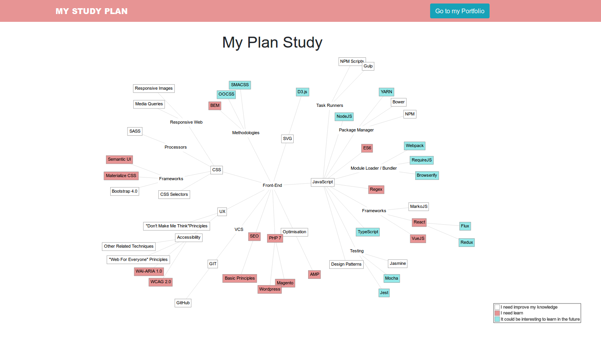

​
My Front-End Road Map
=====================

​I once received an e-mail containing a “[roadmap](https://github.com/kamranahmedse/developer-roadmap)” about programming.
This road map has three paths related to Front-End Development,
Back-End Development and DevOps. It became very popular.
So, it inspired me to create my “roadmap” with subjects related
to my professional necessities. Although the roadmap created by
[Kamran Ahmed](https://github.com/kamranahmedse) is good, it doesn’t match completely with my future
plans.

I divided my roadmap in subjects related to front-end knowledge:
CSS, JavaScript, Optimization, UX, Version Control, SEO, PHP 7
and SVG. Each subject has more specific topics.
After it, I categorized the subjects in 3 categories:

1. ​Technologies that I know, but It’s important to improve my knowledge on them;
2. Popular or useful technologies that I want to learn;
3. And technologies that could be interesting to learn in the future.

​**Technologies that I need to improve my knowledge**

These subjects are technologies I know how to use,
but I want use them better. My plan is to use these
technologies whenever I have the opportunity in my projects.

**Technologies that I want to learn**
​
The job market requires knowledge in several technologies,
some of them I know, but others I don't. There are a lot of
languages and frameworks to learn. So, I choose them because
I think it could be important for my work. These technologies
that I chose are constantly present in the requirements of a
job vacancy.

**Technologies that could be interesting to know in the future**

Finally, these subject are unimportant technologies, for me,
in the present moment. They are famous topics,
but I don't have enough time to study them.
So, I believe that I could learn it in the future,
after learning the technologies I planned.
​

In conclusion, this is not a fixed plan,
it can change according to my necessities.
These will be my steps for the next years.
I don't expect to learn everything that I put in this plan,
but I'm keen to improve my code.

## How to run

* Open your browser;
* Then, open the index.html;
* Done, the study plan will load!
